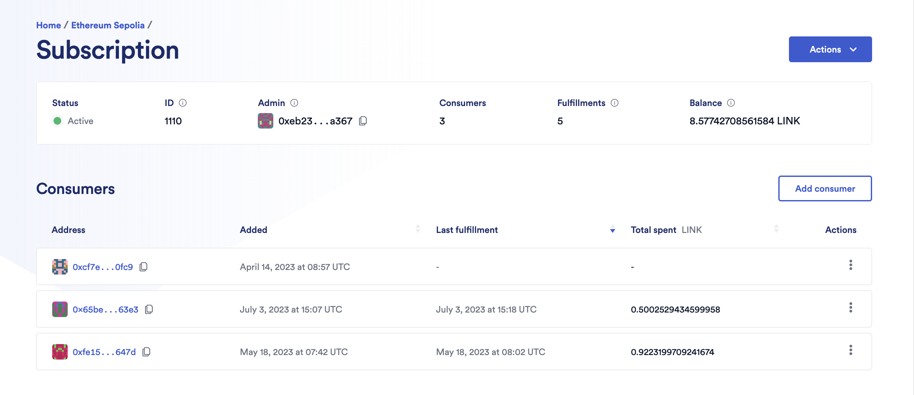

# Hardhat Smartcontract Lottery (Raffle)





Contract CODE: https://sepolia.etherscan.io/address/0x65beDf7aB9597f046976B887a9172eB4bD8163e3#writeContract
*This repo has been updated to work with Sepolia over Goerli.*

This is a section of the Javascript Blockchain/Smart Contract FreeCodeCamp Course.

*[⌨️ (13:41:02) Lesson 9: Hardhat Smart Contract Lottery](https://www.youtube.com/watch?v=gyMwXuJrbJQ&t=49262s)*

[Full Repo](https://github.com/smartcontractkit/full-blockchain-solidity-course-js)

- [Hardhat Smartcontract Lottery (Raffle)](#hardhat-smartcontract-lottery-raffle)
- [Getting Started](#getting-started)
  - [Requirements](#requirements)
  - [Quickstart](#quickstart)
- [Usage](#usage)
  - [Testing](#testing)
    - [Test Coverage](#test-coverage)

# Getting Started

## Requirements

- [git](https://git-scm.com/book/en/v2/Getting-Started-Installing-Git)
  - You'll know you did it right if you can run `git --version` and you see a response like `git version x.x.x`
- [Nodejs](https://nodejs.org/en/)
  - You'll know you've installed nodejs right if you can run:
    - `node --version` and get an ouput like: `vx.x.x`
- [Yarn](https://yarnpkg.com/getting-started/install) instead of `npm`
  - You'll know you've installed yarn right if you can run:
    - `yarn --version` and get an output like: `x.x.x`
    - You might need to [install it with `npm`](https://classic.yarnpkg.com/lang/en/docs/install/) or `corepack`

## Quickstart

```
git clone https://github.com/Solidityarchitect/hardhat-lottery
cd hardhat-lottery
yarn
```

# Usage

Deploy:

```
yarn hardhat deploy
```

## Testing

```
yarn hardhat test
```

### Test Coverage

```
yarn hardhat coverage
```

